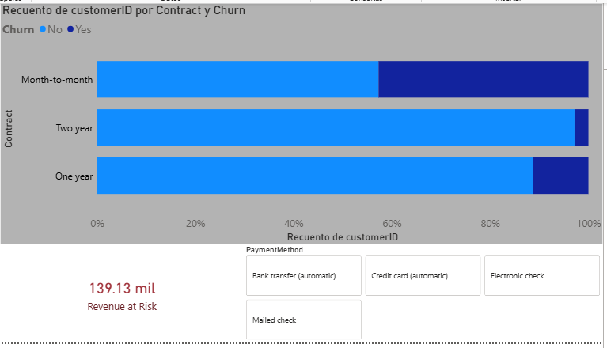

# Telco Customer Churn: Retention & Revenue Impact Analysis
### 📊 SQL Analysis & Power BI Dashboard for Customer Loyalty

**Author:** Alejandro Diaz  
**Role:** Data Analyst | Business Intelligence Focus

---

## 🎯 Project Overview
This project examines customer churn patterns for a Telecommunications company using a dataset of 7,000+ records. The goal is to identify high-risk segments and quantify the **Monthly Revenue at Risk** to support data-driven retention strategies.

*This project focuses on exploratory churn analysis and KPI calculation from a junior data analyst perspective.*

---

## 📈 Key Business Insights

* **The Contract Gap:** Customers on **month-to-month contracts** show a 42.7% churn rate, compared to only 2.8% for two-year contracts. This is the primary driver of instability.
* **High-Value Attrition:** Churned customers generate an average **Monthly Revenue of $74.44**, which is 21% higher than retained customers ($61.27). The company is losing its most profitable segments.
* **Payment Friction:** The **Electronic Check** method is correlated with the highest churn rate, while automated methods (Credit Card/Bank Transfer) show significantly higher retention.

---

## ⚙️ Project Scope & Limitations
* **Timeframe:** Analysis represents a snapshot in time; longitudinal trends (seasonality) are not included.
* **Churn Definition:** Churn is defined as customers who left within the last month.
* **Revenue Logic:** Projections focus on **Monthly Recurring Revenue (MRR)**, not Lifetime Value (LTV).

---

## 💡 Potential Actions for Stakeholders

1. **Contract Migration:** Encourage the transition from monthly to 1-year contracts through "Loyalty Discounts" applied to the 3rd month.
2. **Automated Billing Incentives:** Offer a one-time credit (e.g., $5 USD) for customers who switch from Electronic Check to Auto-pay.
3. **High-Value Save Desk:** Implement a priority retention team specifically for customers with monthly charges above $70 USD.

### 📊 Dashboard Visualization.

---

## 📁 Repository Structure

| File | Description | Business Logic |
| :--- | :--- | :--- |
| **00_setup_schema.sql** | Schema & DDL | Defines table structure and ensures correct data types for financial columns. |
| **01_churn_analysis.sql** | Contract Segmentation | Calculates Churn Rate % per contract type using FILTER. |
| **02_revenue_at_risk.sql** | Financial Impact | Compares average billing between churned and retained users. |
| **03_payment_behavior.sql** | Friction Analysis | Identifies Churn vs. Payment Method to detect billing issues. |
| **viz/dashboard_churn.png** | Visualization | Screenshot of the interactive Power BI Dashboard. |
| **dashboard_churn.pbix** | PBI Source | Original Power BI file for technical review. |

---

## 💻 Technical Stack
* **SQL (PostgreSQL):** Aggregations, Filter functions, Type casting, and Financial ratios.
* **Power BI:** DAX measures, interactive slicers, and churn heatmaps.
* **Business Intelligence:** Churn Rate, MRR at Risk, and Segment Profiling.

---
*"Helping businesses understand not just who leaves, but how much it costs to let them go."*